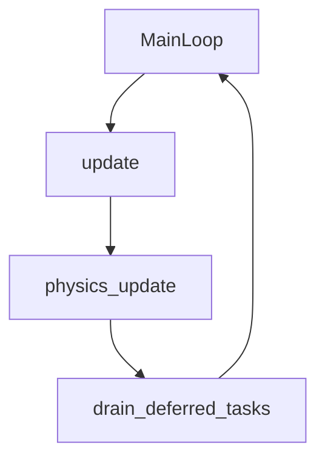
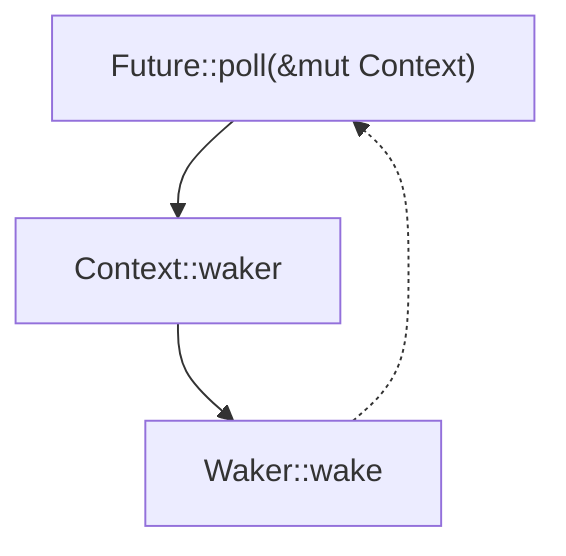

About Me
===

- tinkering with rust since 2018
- Professionally doing rust since 2021
- Contributing to godot-rust since Godot 4 rewrite
- Joined the godot-rust maintainers in 2025

<!-- end_slide -->

Goals
===

- Enable async Rust code in Godot
- Keep overhead to a minimum
- Similar behavior to GDScript

<!-- end_slide -->
Async in GDScript
===

<!-- column_layout: [4, 6] -->

<!-- column: 0 -->
* Async functions return `FunctionState` state machine
* `FunctionState` emits complete signal
* signals drive await points

<!-- column: 1 -->
```gdscript +line_numbers {1-6|9-10}
func background_task() -> int:
  var initial := 10

  var signal_value = await self.signal

  return initial + signal_value


func caller():
  var value := await background_task()
```

<!-- end_slide -->

Godot's Signals
===

```gdscript +line_numbers {1|3-5}
signal reduce_health(amount: int)

func hit():
  self.reduce_health.emit(1)
                                       
```

<!-- end_slide -->

Godot's Signals
===

```gdscript +line_numbers {3-5}
signal reduce_health(amount: int)

func hit():
  for subscriber in self.reduce_health:
    subscriber(1)
```

<!-- end_slide -->

Godot's Execution Order
===

<!-- column_layout: [1, 1] -->

<!-- column: 0 -->

* `MainLoop` on the main thread
* Deferred tasks after main loop
* Synchronous signals at any time

<!-- column: 1 -->


<!-- end_slide -->

Async in Rust 1 / 2
===

```rust +line_numbers {1-5|7-9}
pub trait Future {
  type Output;

  fn poll(self: Pin<&mut Self>, cx: &mut Context<'_>) -> Poll<Self::Output>;
}

async fn some_async_function() -> usize {
  42
}
````
<!-- end_slide -->

Async in Rust 2 / 2
===



<!-- end_slide -->

Proof of Concept 1 / 4: Tasks
===

```rust +line_numbers {1-3|5-7|9-13|15,17-18,21-22}
fn main() {
  godot_task(async { ... });
}

struct GodotWaker {
  runtime_index: usize,
}

struct AsyncRuntime {
  tasks: Vec<Option<Pin<Box<dyn Future<Output = ()>>>>>,
}

static ASYNC_RUNTIME: RefCell<AsyncRuntime> = RefCell::new(AsyncRuntime::new());

pub fn godot_task(future: impl Future<Output = ()> + 'static) {
  let waker: Waker = ASYNC_RUNTIME.with_borrow_mut(move |rt| {
    let task_index = rt.add_task(Box::pin(future));
    Arc::new(GodotWaker::new(task_index)).into()
  });

  waker.wake();
}
```
<!-- end_slide -->


Proof of Concept 2 / 4: Waker
===

```rust +line_numbers {2,20|3,4|7-10|12-13|15-18}
impl Wake for GodotWaker {
  fn wake(self: std::sync::Arc<Self>) {
    let waker: Waker = self.clone().into();
    let mut ctx = Context::from_waker(&waker);

    ASYNC_RUNTIME.with_borrow_mut(|rt| {
      let Some(future) = rt.get_task(self.runtime_index) else {
        godot_error!("Future no longer exists! This is a bug!");
        return;
      };

      // this does currently not support nested tasks.
      let result = future.poll(&mut ctx);

      match result {
        Poll::Pending => (),
        Poll::Ready(()) => rt.clear_task(self.runtime_index),
      }
    });
  }
}
```
<!-- end_slide -->

Proof of Concept 3 / 4: Futures
===

```rust +line_numbers {1-3,8,17|1-3,9|1-3,11-13|1-3,15-16}
pub struct SignalFuture<R: FromSignalArgs> {
  state: Arc<Mutex<(Option<R>, Option<Waker>)>>,
}

impl<R: FromSignalArgs> Future for SignalFuture<R> {
  type Output = R;

  fn poll(self: Pin<&mut Self>, cx: &mut Context<'_>) -> Poll<Self::Output> {
    let mut state = self.state.lock().unwrap();

    if let Some(result) = state.0.take() {
      return Poll::Ready(result);
    }

    state.1.replace(cx.waker().clone());
    Poll::Pending
  }
}
```

<!-- end_slide -->

Proof of Concept 4 / 4: Futures
===


```rust +line_numbers {2,21|3-4|6-7,16-18|20|8|9-10|12-14}
impl<R: FromSignalArgs> SignalFuture<R> {
  fn new(signal: Signal) -> Self {
    let state = Arc::new(Mutex::new((None, Option::<Waker>::None)));
    let callback_state = state.clone();

    signal.connect(
      Callable::from_fn("async_task", move |args: &[&Variant]| {
        let mut lock = callback_state.lock().unwrap();
        let waker = lock.1.take();
        lock.0.replace(R::from_args(args));
        drop(lock);
        if let Some(waker) = waker {
          waker.wake();
        }
        Variant::nil()
      }),
      ConnectFlags::ONE_SHOT.ord() as i64,
    );

    Self { state }
  }
}
```

<!-- end_slide -->

And We Are Done...
===

```rust +line_numbers
  let tree: Gd<SceneTree>;
  let signal = Signal::from_object_signal(&tree, "process_frame");

  godot_task(async move {
    let _: () = signal.to_future().await;

    godot_print!("async task complete!");
  });
```

<!-- end_slide -->

<!-- jump_to_middle -->
Are We Done?
===

<!-- end_slide -->

<!-- jump_to_middle -->
Challenges 0 of 4
===

<!-- end_slide -->

Challenge 1: Please Don't Poll Yet!
===

- Some futures don't like to be polled right away.
- Polling must happen in new call stack.
- How can we poll "later"?

<!-- pause -->
---

Solution
===

- start poll future in deferred godot callable

<!-- end_slide -->

Challenge 2: Signals Can Be Emitted on any Thread
===

- No limitation on which thread a signal is emitted.
- Synchronous signal dispatch can cause subscribers to move between threads.
- Non-thread-safe `Signal` arguments could move across threads.

<!-- pause -->
---

Solution
===

- Godot's deferred calls always run on main-thread
- Restrict `godot_task(...)` to main-thread.
- Deferred polling solves both problems

<!-- end_slide -->

Challenge 1 & 2 Changes
===

```rust +line_numbers {4-10|12|17-18}
impl Wake for GodotWaker
  fn wake(self: Arc<Self>) {
    let mut waker = Some(self);
    let callable = Callable::from_sync_fn(
      "GodotWaker::wake",
      move |_args| {
        poll_future(waker.take().expect("Callable will never be called again"));
        Variant::nil()
      },
    );

    callable.call_deferred(&[]);
  }
}

pub fn godot_task(future: impl Future<Output = ()> + 'static) -> TaskHandle {
  assert!(crate::init::is_main_thread(),
          "godot_task() can only be used on the main thread");
  // [...]
}
```

<!-- end_slide -->

Challenge 3: Objects Are Neither `Send` Or `Sync`
===

- Godot objects are not thread safe.
- Either manually managed or ref-counted.
- Exact number of references unknown.
- `godot-rust` thread safety so far unsolved.

<!-- end_slide -->

Solve Challenge 3: `DynamicSend` 1 / 3
===

```rust +line_numbers
/// # Safety
/// The implementor has to guarantee that `extract_if_safe` returns `None`, if the value
/// has been sent between threads while being `!Send`.
///
/// To uphold the `Send` supertrait guarantees, no public API apart from `extract_if_safe`
/// must exist that would give access to the inner value from another thread.
pub unsafe trait DynamicSend: Send + Sealed {
  type Inner;

  fn extract_if_safe(self) -> Option<Self::Inner>;
}
```

<!-- end_slide -->

Solve Challenge 3: `DynamicSend` 2 / 2
===
```rust +line_numbers {1-4|7-13}
pub struct ThreadConfined<T> {
  value: Option<T>,
  thread_id: ThreadId,
}

impl<T> ThreadConfined<T> {
  pub(crate) fn extract(mut self) -> Option<T> {
    if self.is_original_thread() {
      self.value.take()
    } else {
      None // causes Drop -> leak.
    }
  }

  fn is_original_thread(&self) -> bool {
    self.thread_id == std::thread::current().id()
  }
}
```

<!-- end_slide -->

Challenge 4: Signal-Objects Can Be Freed any Time
===

- Most signal objects are manually managed.
- Dangling futures when signal object is freed.

<!-- end_slide -->

Solve Challenge 4: `FalibleSignalFuture`
===

- Track when signal closure is dropped
- Mark futures as dead when closure is dropped
- resolve dead futures with `Err`
- `SignalFuture` wrapper around `FalibleSignalFuture` that panics

<!-- end_slide -->

And More
===

- Catch panics and track which future they belong to.
- `FutureSlot` state machine to track task states.
- Support for nested tasks (`godot_task(...)` inside other `godot_task`)
- Some naming changed like `godot_task` -> `godot::task::spawn`

<!-- end_slide -->

Links & Handles
===

<!-- column_layout: [2, 1] -->

<!-- column: 0 -->
# Project Links
- [Project Page](https://godot-rust.github.io)
- [Repo](https://github.com/godot-rust/gdext)
- [Full Implementation](https://github.com/godot-rust/gdext/tree/master/godot-core/src/task)

# My Handles
- GitHub: @TitanNano
- Matrix: @titannano:mozilla.org
- Mastodon: @titannano@mastodon.online

<!-- column: 1 -->


<!-- alignment: center -->
Project Page

<!-- end_slide -->

Solve Challenge 4: Impl 1 / 3
===

```rust +line_numbers {9-13}
pub struct SignalFutureResolver<R: IntoDynamicSend> {
  data: Arc<Mutex<SignalFutureData<R::Target>>>,
}

impl<R: IntoDynamicSend> Drop for SignalFutureResolver<R> {
  fn drop(&mut self) {
    let mut data = self.data.lock().unwrap();

    if !matches!(data.state, SignalFutureState::Pending) {
      return;
    }

    data.state = SignalFutureState::Dead;

    if let Some(ref waker) = data.waker {
      waker.wake_by_ref();
    }
  }
}
```

<!-- end_slide -->

Solve Challenge 4: Impl 2 / 3
===

```rust +line_numbers {3-20}
impl<R: InParamTuple + IntoDynamicSend> FallibleSignalFuture<R> {
  fn poll(&mut self, cx: &mut Context<'_>) -> Poll<Result<R, FallibleSignalFutureError>> {
    let mut data = self.data.lock().unwrap();
    let value = data.state.take();

    data.waker.replace(cx.waker().clone());
    drop(data); // Drop data lock to prevent mutext poisoning by potential later panic.

    match value {
      SignalFutureState::Pending => Poll::Pending,
      SignalFutureState::Dropped => unreachable!(),
      SignalFutureState::Dead => Poll::Ready(Err(FallibleSignalFutureError)),
      SignalFutureState::Ready(value) => {
        let Some(value) = DynamicSend::extract_if_safe(value) else {
          panic!("the awaited signal was not emitted on the main-thread, [...]");
        };

        Poll::Ready(Ok(value))
      }
    }
  }
}
```

<!-- end_slide -->

Solve Challenge 4: Impl 3 / 3
===

```rust +line_numbers {10-12}
impl<R: InParamTuple + IntoDynamicSend> Future for SignalFuture<R> {
  type Output = R;

  fn poll(self: Pin<&mut Self>, cx: &mut Context<'_>) -> Poll<Self::Output> {
    let poll_result = self.get_mut().0.poll(cx);

    match poll_result {
      Poll::Pending => Poll::Pending,
      Poll::Ready(Ok(value)) => Poll::Ready(value),
      Poll::Ready(Err(FallibleSignalFutureError)) => panic!(
        "the signal object was freed, while the future was waiting"
      ),
    }
  }
}
```
